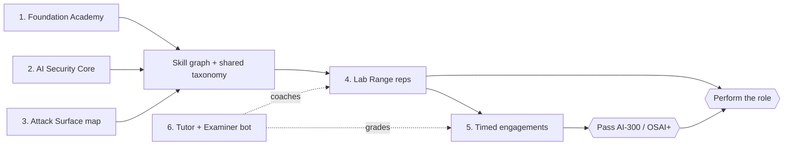

# OSAI Prep Studio — Vision

> Purpose: State what we are building and why — an OffSec-style interactive **training range** for AI red teaming whose north star is to make a learner able to **pass the OffSec AI-300 / OSAI exam and excel day-to-day in the role**. This doc is the "why"; the normative exam facts live in [00b-exam-blueprint.md](00b-exam-blueprint.md).

## North star

> Give a learner the **practical, hands-on ability to pass AI-300 / OSAI+ and perform the job** of an AI red teamer — not by watching videos, but by doing reps in an authorized range: enumerate AI systems, exploit them, capture evidence, explain business impact, and write a professional report.

Everything in this suite is graded against one question: *does it move a learner closer to "pass + perform"?* If a feature is fun but doesn't, it goes to Phase 4 or gets cut.

## The problem we solve

AI-300 is **advanced**, **hands-on**, and **report-heavy**. OffSec frames it as ~65 hours of content covering attacks on LLMs, multi-agent systems, RAG pipelines, embeddings, AI infrastructure, and cloud security, culminating in a **practical 24-hour exam** against AI-enabled systems ([OffSec][ai300]). Yet most "AI security" prep on the market is passive: slide decks, lecture videos, and quizzes that test recall, not capability.

A candidate who has only watched content walks into a 24-hour engagement unable to *operate*: they freeze on recon, they can't chain an injection into impact, and — most fatally — they cannot turn findings into a defensible report. OSAI Prep Studio closes that gap by being a **range first, a courseware second**: every concept has a lab, every lab produces evidence, and every engagement ends in a report.

It is built **reuse-first** on top of the existing [`llm-threat-triage`](../README.md) repository — a tested LLM-attack detection engine, a dual OWASP-LLM-Top-10 + MITRE-ATLAS reference library, and an offline red-team harness — so the studio launches on a real, working foundation instead of a green field (see [09b-reuse-map.md](09b-reuse-map.md)).

## The six pillars

| # | Pillar | What it is | Why it drives a *pass* | Why it matters *on the job* |
|---|--------|------------|------------------------|------------------------------|
| 1 | **Foundation Academy** | Pre-AI-300 scaffolding: Linux, networking, web/APIs, scripting, recon mindset, reporting basics | AI-300 *recommends* OSCP/equivalent; weak fundamentals sink AI engagements | AI systems still run on the same infra that traditional pentest skills cover |
| 2 | **AI Security Core** | How LLM apps, RAG, embeddings, agents, tools/MCP, model gateways, and cloud AI are built — and where trust boundaries leak | You can't attack what you can't diagram; recon depends on it | Day-one fluency with the systems you're hired to assess |
| 3 | **AI Red Team Attack Surface** | The mapped threat catalog: OWASP LLM Top 10 (2025), OWASP Agentic threats, MITRE ATLAS, NVIDIA AI Kill Chain | The exam tests breadth across the AI attack surface | A shared vocabulary to communicate findings to security + ML teams |
| 4 | **Enterprise AI Lab Range** | A Dockerized "MegacorpAI"-style enterprise: chatbot, RAG store, agent/MCP tools, planted secrets, logging — with auto-graded labs | Reps under realistic conditions are the only thing that builds operator skill | Mirrors the real systems and constraints of a paid engagement |
| 5 | **Exam-Style Performance Mode** | Timed multi-target engagements: recon → exploit → post-exploit → evidence → report, scored on a rubric | Rehearses the exact 24-hour engagement shape and pacing | Engagement discipline, time-boxing, and evidence hygiene transfer directly |
| 6 | **AI Tutor + Examiner Bot** | A retrieval-first, citation-grounded coach with modes (Tutor, Socratic, Hint-ladder, Flashcard, Report-Reviewer, Exam-Sim, No-Hints) — see [03-tutor-examiner-bot.md](03-tutor-examiner-bot.md) | A coach that *never hands over the flag* but unblocks you accelerates mastery; the exam allows AI, so we teach attacking *with* AI | A model for the AI-assisted workflow you'll actually use professionally |

## Who it's for (personas)

- **The OSCP pivoter.** Strong offensive fundamentals, new to AI internals. Needs Pillars 2–4 most; uses Foundation Academy as a refresher and the AI Security Core to learn what RAG/agents/MCP even are before attacking them.
- **The AppSec / pentest engineer.** Comfortable with web/API/cloud, needs the AI-specific attack surface, agentic/MCP labs, and the reporting rubric tuned to AI findings.
- **The ML / platform engineer going offensive.** Knows how the systems are built, needs the adversarial mindset, the methodology (recon→exploit→report), and the professional-reporting muscle the exam demands.

The studio meets each where they are via the **diagnostic + readiness model** ([14-readiness-model.md](14-readiness-model.md)), which routes weak areas to specific lessons and labs instead of a one-size path.

## What makes it world-class (differentiators)

1. **A range, not a lecture.** Every concept is earned through an auto-graded lab in an authorized environment ([02-lab-range.md](02-lab-range.md)).
2. **One taxonomy spine.** The `owasp_id` / `atlas_technique` / `detector` / `severity` fields from the existing detection engine are *simultaneously* the grader verdict, the lesson skill-tag, the spaced-repetition mastery unit, the gold-set label, and the report finding-classifier. This is what makes the product cohere instead of fragmenting into six disconnected tools (see [09b-reuse-map.md](09b-reuse-map.md)).
3. **Two-signal grading.** A lab passes only when (a) the reused detector verdict fires **and** (b) the attack physically produces an evidence token (flag file / DB-state change / callback hit) — defeating both regex false-negatives and learners gaming a sentinel string.
4. **Methodology scoring, not flag-hunting.** Attack-path graphs ([16-attack-path-graphs.md](16-attack-path-graphs.md)) score the operator loop — recon → hypothesis → probe → exploit → impact → remediation → retest — because that loop, not the flag, is the job.
5. **Reporting as a first-class deliverable.** OffSec requires a professional report; its exact weighting is unpublished (`pending`, see [00b-exam-blueprint.md](00b-exam-blueprint.md)), so we deliberately over-invest in a Report-Reviewer with a business-impact rubric ([19-business-impact-rubric.md](19-business-impact-rubric.md)) — the most under-built area in competing prep, and the one most candidates neglect.
6. **Teach attacking *with* AI.** Because OffSec confirms AI use will be allowed in the OSAI exam ([00b-exam-blueprint.md](00b-exam-blueprint.md)), every Track 3–5 lab includes a "now automate this with PyRIT / garak / an attacker-LLM" extension — a uniquely OSAI-relevant skill.
7. **A tutor that won't lie.** Retrieval-first, citation-enforced, source-authority-tiered, and abstaining ("no source, no confident answer"), gated behind a hard evaluation harness ([04-evaluation-harness.md](04-evaluation-harness.md)). A prep tool that confidently teaches *wrong* security is worse than none.
8. **Drift-resistant by construction.** A claim-confidence ledger ([00b-exam-blueprint.md](00b-exam-blueprint.md)) and a framework-version ledger ([15-framework-version-ledger.md](15-framework-version-ledger.md)) keep stale OffSec assumptions and OWASP/ATLAS/NIST changes from silently becoming product dogma.
9. **Built on a real engine.** The detectors, SQL analytics, and red-team harness already exist, are tested, and map every finding to OWASP + ATLAS — the studio inherits a working spine on day zero.

## Scope of this blueprint

This suite is **design-only**: schemas, file trees, lab specs, pseudocode, rubrics, and acceptance criteria. No runnable application code ships in this phase — building it is a separately greenlit effort sequenced in [10-mvp-roadmap.md](10-mvp-roadmap.md). The 30-day MVP teaser: **Week 1** source library + tutor + quiz engine; **Week 2** AI-architecture lessons + flashcards + study exports; **Week 3** the first three labs (prompt injection, RAG leakage, agent/MCP tool misuse); **Week 4** timed mini-exam + report grader + dashboard.

## Cross-references

- Normative exam facts and the claim ledger → [00b-exam-blueprint.md](00b-exam-blueprint.md)
- Curriculum and track↔module reconciliation → [01-curriculum.md](01-curriculum.md)
- Reuse of the existing repo → [09b-reuse-map.md](09b-reuse-map.md)
- Build sequence → [10-mvp-roadmap.md](10-mvp-roadmap.md)
- Safety / legal boundary → [11-safety-legal-ethics.md](11-safety-legal-ethics.md)

## Sources

- OffSec — AI-300 course & OSAI certification: <https://www.offsec.com/courses/ai-300/>
- OffSec — OSCP to OSAI pivot: <https://www.offsec.com/blog/oscp-to-osai-how-offensive-security-practitioners-can-pivot-into-ai-security/>
- OWASP Top 10 for LLM Applications (2025): <https://genai.owasp.org/llm-top-10/>

[ai300]: https://www.offsec.com/courses/ai-300/
