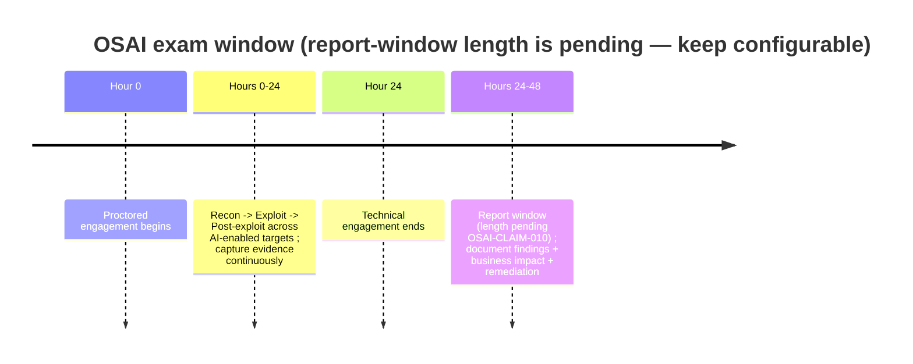

# OSAI / AI-300 Exam Blueprint (Normative)

> Purpose: The single, cited, confidence-labeled reference for what AI-300 / OSAI actually is. Every other doc traces its exam assumptions to this file, and **all exam assumptions are isolated here** so a spec change is a one-file edit. Where OffSec has not published a detail, we say so and keep it configurable.

## 0. How to read this doc — the Claim Confidence Ledger

AI-300 / OSAI is **new** (2026) and parts of its exam guidance are still being finalized. To stop unstable details from becoming accidental product dogma, every claim about OffSec, the course, or the exam carries a confidence label.

| Confidence | Meaning | Usage rule |
|---|---|---|
| `confirmed` | Published by OffSec or another authoritative primary source | May drive curriculum and readiness gates |
| `inferred` | Reasonable conclusion from public sources, FAQ headings, or pattern-matching to other OffSec exams | May guide prep, but must **not** be presented as official |
| `pending` | OffSec has not finalized/published, or the source is gated | Treat as configurable; do **not** hard-code into scoring or exam mode |
| `deprecated` | Previously believed but superseded | Keep for history; do not use in product behavior |

**Governance rules** (enforced in CI — see [12-content-authoring.md](12-content-authoring.md)):
- No exam claim may appear in the README or curriculum without a ledger ID.
- Any `pending` claim must be visibly marked in generated study material.
- The app exposes an `exam_config.yml` so report-window length, allowed tools, and exam-mode constraints update without code changes (§9).

### 0.1 Initial claim ledger

| ID | Claim | Status | Source |
|----|-------|--------|--------|
| OSAI-CLAIM-001 | AI-300 is OffSec's *Advanced AI Red Teaming* course for assessing/exploiting modern AI systems | `confirmed` | [course page][ai300] |
| OSAI-CLAIM-002 | AI-300 includes ~65 hours of content | `confirmed` | [course page][ai300] |
| OSAI-CLAIM-003 | Covers attacks on LLMs, multi-agent systems, RAG pipelines, embeddings, AI infrastructure, cloud security | `confirmed` | [course page][ai300] |
| OSAI-CLAIM-004 | The exam is a practical **24-hour** red-team engagement against AI-enabled systems | `confirmed` | [course page][ai300] |
| OSAI-CLAIM-005 | The exam is **proctored** | `confirmed` | [exam FAQ][examfaq] |
| OSAI-CLAIM-006 | Earliest opened OSAI+ exam date is **2026-07-15, 07:00 GMT** | `confirmed` | [exam FAQ][examfaq] |
| OSAI-CLAIM-007 | **AI usage is allowed** in the OSAI exam; guidelines to be shared closer to release | `confirmed` | [exam FAQ][examfaq] |
| OSAI-CLAIM-008 | AI-300 has **11 modules** | `confirmed` | [AI-300 FAQ][coursefaq] |
| OSAI-CLAIM-009 | The exact AI-300 module **titles and sequence** | `inferred` | public pages + FAQ headings |
| OSAI-CLAIM-010 | The report window is exactly **24 hours** after the technical exam | `pending` | await OSAI Exam Guide |
| OSAI-CLAIM-011 | The report is weighted **as heavily as** technical findings | `pending` | await OSAI Exam Guide |
| OSAI-CLAIM-012 | **OSCP or equivalent** hands-on experience is recommended, not required | `confirmed` | [course page][ai300] |
| OSAI-CLAIM-013 | AI-300 includes **XP / leaderboard** gamification | `confirmed` | [AI-300 FAQ][coursefaq] |
| OSAI-CLAIM-014 | **OSAI+** expires after 3 years; **OSAI** remains valid indefinitely | `confirmed` | [course page][ai300] |
| OSAI-CLAIM-015 | Course general availability in **2026** (early-access window opened 2026-03-31) | `inferred` | OffSec announcements |

> The full machine-readable ledger lives in `exam-claims.yml` (see [12-content-authoring.md](12-content-authoring.md)); this table is its human view.

## 1. Certification facts

- **Course:** AI-300 (Advanced AI Red Teaming). **Cert:** OSAI / OSAI+. `confirmed` (001).
- **Effort:** ~65 hours of course content; plan additional hours for range reps. `confirmed` (002).
- **Renewal:** OSAI+ valid 3 years; OSAI indefinite. `confirmed` (014).
- **Prereqs:** OSCP / pentest concepts / networking / Linux+Windows / scripting **recommended, not required**; AI/ML familiarity helpful, not required. `confirmed` (012). → We treat Tracks 0–1 as readiness scaffolding, not gates.

## 2. The engagement model



- **24-hour proctored, hands-on** red-team engagement (not multiple-choice). `confirmed` (004, 005).
- Candidates perform **reconnaissance**, **exploitation**, and **post-exploitation**, then **document findings** in a professional report.
- **No published passing threshold** (consistent with OffSec's posture on other practical exams) — `inferred`.
- The report is a required deliverable. Whether it is weighted *equally* with technical findings is **`pending`** (011) — so we **train reporting heavily as a differentiator** but never present a specific weighting as official. The "~50% report weight" used loosely elsewhere is a **design estimate**, not an OffSec figure.

## 3. Target environment shape

A realistic **AI-enabled enterprise** — "MegacorpAI" in our range — combining: deployed **LLM applications**, **RAG pipelines**, **multi-agent / MCP tool** workflows, and **cloud-hosted AI services**, deployed the way real orgs deploy AI (i.e., without explicit red-team hardening). `confirmed`-aligned with (003, 004). Our [02-lab-range.md](02-lab-range.md) and the capstone in [21-world-class-additions.md](21-world-class-additions.md) reproduce this shape.

## 4. AI-tools-allowed rule → practice modes

OffSec confirms **AI usage will be allowed** in the OSAI exam, with specific guidelines pending (007). This is **unique** among OffSec exams and has two design consequences:

1. We teach **attacking *with* AI** (PyRIT / garak / an attacker-LLM driving the engagement) as a first-class skill, not just defending against AI.
2. We ship **switchable practice modes** — `NO_AI`, `SOCRATIC_AI`, `HINT_LADDER`, `AI_ASSISTED`, `ATTACK_WITH_AI`, and a data-driven `EXAM_CURRENT` that mirrors the latest confirmed OffSec rule. Full policy in [18-ai-use-policy-for-exam-mode.md](18-ai-use-policy-for-exam-mode.md).

Until the final guidelines publish, `EXAM_CURRENT` shows an uncertainty banner and treats specific allowed/prohibited uses as `pending`.

## 5. Course module map (titles/sequence = inferred)

AI-300 has **11 modules** (008); titles and ordering below are **`inferred`** (009) and stored as config, updated when an official syllabus is obtained.

| Module | Inferred theme | Studio track |
|---|---|---|
| M1 | Intro to Red Teaming AI — MITRE ATLAS, OWASP LLM Top 10, NVIDIA AI Kill Chain | Track 2 |
| M2 | Reconnaissance for AI targets — model fingerprinting, RAG recon, evasion | Track 3 |
| M3 | Single-agent / LLM-app attacks | Track 3 |
| M4 | Multi-agent attacks | Track 4 |
| M5 | RAG-pipeline exploitation | Track 3 |
| M6 | MCP tool-surface attacks | Track 4 |
| M7 | Supply-chain attacks | Track 4 |
| M8 | Cloud ML service attacks | Track 5 |
| M9 | Kubernetes / model-server exploitation, adversarial ML | Track 5 |
| M10 | Synthesis / AI threat modeling | Track 6 |
| M11 | Capstone engagement (MegacorpAI) | Track 6 |

A **prerequisite** path — OffSec's **LLM Red Teaming** learning path (~30h, 6 modules: LLM fundamentals → enumeration → prompt injection → jailbreaking → supply chain → unsafe output handling; tools Open WebUI, Ollama, LangChain) — is mirrored by Tracks 0–2. `confirmed`-aligned with the public path page.

## 6. Gamification

The course includes a **leaderboard and XP** system, separate from account-wide XP (013). We build XP/leaderboard-inspired features ([05-progress-engine.md](05-progress-engine.md)) but keep them **secondary to real readiness** ([14-readiness-model.md](14-readiness-model.md)).

## 7. Exam-domain weighting (design estimate — NOT official)

OffSec does not publish a domain breakdown. The following is a **planning estimate** to balance our content investment, flagged as `inferred`/design-only:

| Domain | Design-estimate emphasis | Why |
|---|---|---|
| Reconnaissance & enumeration | High | Every engagement starts here; cheap points, sets up everything |
| AI-layer exploitation (LLM/RAG/agentic/MCP) | Highest | The core of the course and exam |
| Infrastructure / cloud / model-server | Medium-High | M8–M9 scope; post-exploitation depth |
| Post-exploitation & impact | Medium-High | Proving impact is what makes a finding real |
| Reporting | High (we over-invest deliberately) | Required deliverable; under-built by competitors (011 pending) |

## 8. Exam-day playbook

1. **First 60–90 min — full-breadth recon.** Enumerate every AI surface (chat endpoints, RAG, agents/MCP tools, model/version fingerprints, cloud services). Note, don't exploit yet. Start the evidence log immediately.
2. **Map to the attack surface.** For each target, hypothesize OWASP/agentic categories and the NVIDIA AI Kill Chain stage. Prioritize by impact × likelihood.
3. **Exploit in impact order.** Chain indirect injection → excessive agency → action; RAG leak → sensitive disclosure; tool/MCP misuse → post-exploitation. **Capture two-signal evidence** for every win (detector-grade transcript **and** a produced artifact: flag, callback, DB change, screenshot).
4. **Time-box ruthlessly.** Cap any single target; bank confirmed findings before chasing hard ones. Keep a running findings table.
5. **Report-first mindset.** Write each finding *as you confirm it* (title, severity, affected asset, repro, evidence, root cause, business impact, remediation, retest — see [19-business-impact-rubric.md](19-business-impact-rubric.md)). A finding you can't reproduce in writing isn't a finding.
6. **Reserve the report window for synthesis,** not first drafts: executive summary, impact narrative, remediation roadmap, appendix.
7. **AI use:** if permitted (007), use it as a copilot (summarize docs, draft report prose, suggest payloads to try) — but never let it replace your own validated evidence. Practice this in `AI_ASSISTED` / `ATTACK_WITH_AI` modes.

## 9. Readiness & the assumptions register

- **Readiness:** the self-assessment + diagnostic that answers "am I ready?" lives in [14-readiness-model.md](14-readiness-model.md) (gates R0–R5, exam-ready ≥ 780/1000 with mandatory sub-gates).
- **Assumptions register (`exam_config.yml`):** every `pending`/`inferred` value (report-window length, allowed-AI specifics, module titles, pass threshold) is a config key, never a hard-coded constant. Changing OffSec guidance = editing this one file + the ledger.

```yaml
# exam_config.yml (illustrative)
exam:
  technical_window_hours: 24          # confirmed (004)
  report_window_hours: 24             # pending (010) — configurable
  report_weight_equal_to_findings: null  # pending (011)
  ai_use_allowed: true                # confirmed (007)
  ai_use_guidelines: pending
  pass_threshold: null                # inferred — not published
  modules: 11                         # confirmed (008)
  module_titles: inferred             # (009)
```

## Sources

- OffSec AI-300 course & OSAI certification: <https://www.offsec.com/courses/ai-300/>
- OffSec OSAI Exam FAQ: <https://help.offsec.com/hc/en-us/articles/46669767163156-OSAI-Advanced-AI-Red-Teaming-Exam-FAQ>
- OffSec AI-300 (course) FAQ: <https://help.offsec.com/hc/en-us/articles/46593095198740-OSAI-Advanced-AI-Red-Teaming-AI-300-FAQ>
- OffSec LLM Red Teaming learning path: <https://www.offsec.com/learning/paths/llm-red-teaming/>
- OffSec OSCP→OSAI pivot: <https://www.offsec.com/blog/oscp-to-osai-how-offensive-security-practitioners-can-pivot-into-ai-security/>

[ai300]: https://www.offsec.com/courses/ai-300/
[examfaq]: https://help.offsec.com/hc/en-us/articles/46669767163156-OSAI-Advanced-AI-Red-Teaming-Exam-FAQ
[coursefaq]: https://help.offsec.com/hc/en-us/articles/46593095198740-OSAI-Advanced-AI-Red-Teaming-AI-300-FAQ
