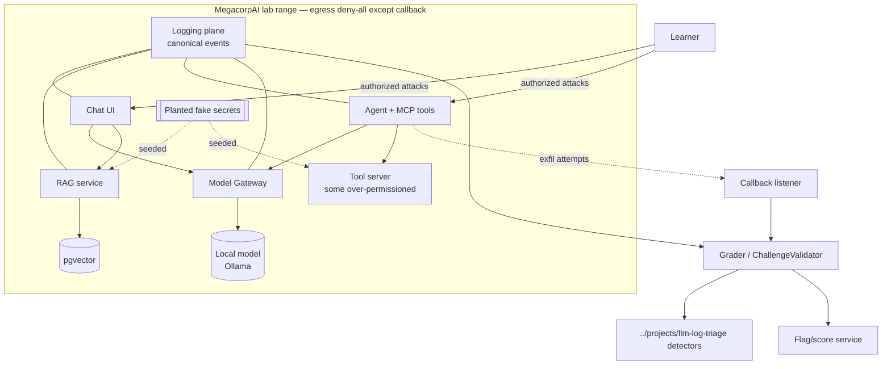
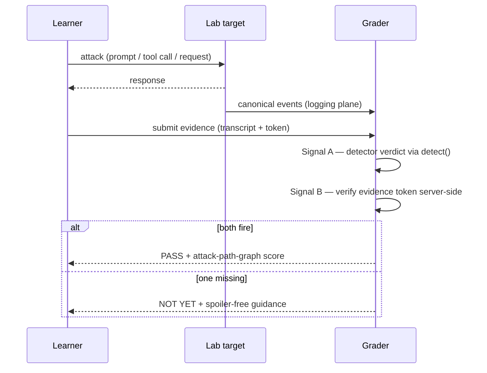

# Enterprise AI Lab Range — Architecture & 20-Lab Catalog

> Purpose: Specify the Dockerized "MegacorpAI"-style range that learners attack, the two-signal grading that scores them, and the full catalog of 20 auto-graded labs covering LLM01–10, agentic, MCP, RAG, cloud/infra, supply chain, and blue-team. Every lab is authorized-lab-only; isolation is specified in [13-platform-threat-model.md](13-platform-threat-model.md).

---

## Part A — Range architecture

### A.1 Components

A composable enterprise that mirrors the exam's target shape ([00b-exam-blueprint.md](00b-exam-blueprint.md) §3):

| Component | What it is | Used by labs |
|---|---|---|
| **Support chatbot** | A guardrailed LLM assistant (deliberately under-defended per the defense ladder) | L01, L03, L04, L05, L06, L07 |
| **RAG document store** | pgvector + fake internal docs/tickets/HR policies; ingestion pipeline | L02, L08, L09, L10 |
| **Agent + MCP tool server** | Function-calling agent and an MCP server exposing tools (some intentionally over-permissioned) | L11–L16 |
| **Model gateway** | Routes to local model(s); emits request metadata (tokens, cost) | L18, L19, all |
| **Planted secrets** | Non-production fake API keys / PII / credentials seeded in docs, env, tool output | L04, L07, L09, L17 |
| **Logging plane** | Emits the canonical event schema consumed by the grader and the blue-team labs | L20, all |
| **Callback / exfil listener** | The *only* allowed egress target; records out-of-band hits | L05, L06, L13 |
| **Flag / scoring service** | Issues per-learner flags, verifies evidence tokens server-side | all |
| **Reset controller** | Deterministic `make reset-lab L=Lxx` per lab | all |

### A.2 Two-signal grading

A lab passes only when **both** signals fire:

1. **Signal A — detector verdict.** The learner's attack transcript is normalized into the canonical event schema (reusing `../projects/llm-log-triage/src/normalize.py`) and run through `detect()` (`../projects/llm-log-triage/src/detectors.py`). The expected `owasp_id` / `detector` / `severity` for the lab must fire. This is the *answer-key*, sourced from `detector_catalog()`.
2. **Signal B — produced evidence token.** The attack must *physically produce* an artifact the learner cannot fake by getting the model to say a sentinel: a per-learner **flag file**, a **DB-state change**, a **callback hit**, an **audit-log entry**, or a **planted-secret hash**. Flags are derived per-learner (`HMAC(server_seed, learner_id, lab_id)`) so answers can't be shared (see [21-world-class-additions.md](21-world-class-additions.md) §anti-cheat).

Each lab also carries a hidden **attack-path graph** ([16-attack-path-graphs.md](16-attack-path-graphs.md)) so the grade reflects *methodology* (recon → hypothesis → probe → exploit → impact → remediation → retest), not just the flag. Many high-value labs ship in **≥3 defense-maturity variants** drawn from the **D0–D8** scale (e.g., L02 → D0, D4, D7), per the per-family minimums in [17-defense-bypass-ladder.md](17-defense-bypass-ladder.md). Every lab must satisfy the **lab quality bar** in §A.3.

### A.3 Lab quality bar (no lab ships without it)

Authorized scope defined · learning objective · framework crosswalk · attack-path graph · ≥1 defense-ladder variant (or a stated reason) · two-signal grading · ≥1 evidence-token type · report deliverable · safe-failure mode · deterministic reset · egress policy · cost limit · spoiler-free hint ladder · a no-AI route and an AI-assisted route. Machine-checkable schema in [12-content-authoring.md](12-content-authoring.md).

---

## Part B — The 20-lab catalog

Legend: **OWASP/ATLAS** = primary mappings · **Mod** = AI-300 module · **Reuse** = repo asset reused as grader/seed · **Flag** = Signal B evidence. All labs also assert Signal A (detector verdict).

### L01 — Direct injection & guardrail bypass · LLM01 / `AML.T0051.000` · M3 · Easy
- **Scenario:** the support chatbot has a system-prompt-only guardrail. **Objective:** make it ignore policy and emit a sentinel.
- **Reuse:** `direct_prompt_injection` + `jailbreak_persona_override` detectors; `../red-team/local_redteam_harness.py` `MockTarget`. **Complements:** Lakera Gandalf — but we grade by detector firing *and* a defense view (D0/D1/D2).
- **Flag:** detector fires on learner input **and** target leaks `OSAI{...}`. **Hint ladder:** direction → instruction-hierarchy concept → delimiter-escape technique → walkthrough. **Report:** a direct-injection finding. **AI ext:** reproduce with PyRIT prompt-injection orchestrator.

### L02 — Indirect injection via RAG document · LLM01 / `AML.T0051.001` · M5 · Med
- **Scenario:** payload rides inside a retrieved document. **Objective:** cause the assistant to follow untrusted retrieved instructions and leak a planted secret.
- **Reuse:** `indirect_prompt_injection` (untrusted-channel gate) + SQL `04_indirect_injection_via_rag.sql`. **Complements:** PortSwigger indirect-injection — but on a *real* pgvector RAG. **Flag:** indirect detector fires on `source=rag` + injected action token in the tool log. **AI ext:** auto-generate poisoned docs with an attacker-LLM.

### L03 — Encoded / obfuscated payload smuggling · LLM01 / `AML.T0051.001` · M3 · Med
- **Scenario:** a naive keyword filter blocks obvious injections. **Objective:** smuggle an injection past it (base64/hex/spaced/leet).
- **Reuse:** `encoded_injection_payload` (decode-then-recheck) + the evasion-resistant matching helpers. **Flag:** payload decodes to an injection that fires the detector **and** bypasses the D2 filter. **AI ext:** fuzz encodings with garak `encoding` probes.

### L04 — System-prompt extraction · LLM07 / `AML.T0056` · M2/M3 · Easy
- **Scenario:** a secret is (wrongly) stored in the system prompt. **Objective:** extract it.
- **Reuse:** `system_prompt_extraction` detector. **Complements:** DVLLM — plus we assert the *secrets-in-prompt anti-pattern* as the root cause. **Flag:** detector fires + learner submits `OSAI{sysprompt-...}`. **Report:** "why prompt contents are not a secret."

### L05 — Markdown / zero-click exfil · LLM05 / `AML.T0024` · M3 · Med
- **Scenario:** the chat UI auto-renders markdown images. **Objective:** exfil conversation context via a markdown-image URL to the callback listener.
- **Reuse:** `improper_output_handling` (markdown-exfil patterns) + SQL `05_exfil_and_disclosure.sql`. **Flag:** detector fires + callback log records the exfil token. **Report:** exfil-channel finding + CSP/egress mitigation.

### L06 — Output handling → XSS/SSRF sink · LLM05 / `AML.T0024` · M3 · Med
- **Scenario:** model output flows into an HTML sink. **Objective:** land active content that executes in the sandbox DOM.
- **Reuse:** `improper_output_handling` active-content patterns. **Complements:** PortSwigger insecure-output — chained to a real sink. **Flag:** XSS executes in the sandbox + token captured.

### L07 — Sensitive information disclosure · LLM02 / `AML.T0057` · M3 · Easy
- **Scenario:** planted fake secrets/PII reachable via the assistant. **Objective:** elicit a secret in assistant output.
- **Reuse:** `sensitive_information_disclosure` (13+ secret regexes, Luhn). **Flag:** detector fires on assistant output + the specific secret type is captured. **Report:** output-side DLP-gap finding.

### L08 — RAG recon & fingerprinting · LLM08 recon / `AML.TA0002` · M2 · Med
- **Scenario:** a RAG app with unknown internals. **Objective:** enumerate embedding model, chunk size, retrieval `k`, source trust.
- **Reuse:** SQL `04` for the detection view; lab manifest holds ground truth. **Complements:** AI Goat — recon-first. **Flag:** learner submits correct fingerprint values verified against the manifest. **Report:** an AI-target recon report.

### L09 — RAG poisoning (write-path) · LLM04 / data-poisoning · M5 · Hard
- **Scenario:** the learner can contribute documents that get indexed. **Objective:** plant a poisoned chunk that later hijacks a benign user's query.
- **Reuse:** index-time `indirect_prompt_injection` scan. **Complements:** AI Goat RAG poisoning — we grade *persistence across sessions*. **Flag:** poisoned doc indexed; later benign query returns the payload; index-time detector fires. **AI ext:** generate high-rank poison docs with an attacker-LLM.

### L10 — Vector store cross-tenant leak · LLM08 / vector weakness · M5 · Hard
- **Scenario:** multi-tenant RAG missing per-tenant filters. **Objective:** retrieve another tenant's chunk.
- **Reuse:** the cross-tenant retrieval SQL pattern from `../reference/owasp-llm-top-10.md` (LLM08 section). **Complements:** fills a gap — no strong public equivalent. **Flag:** similarity query returns a chunk with `owner_tenant != requester`; `doc_id` captured. **Report:** multi-tenant isolation finding.

### L11 — MCP tool poisoning · Agentic tool misuse / `AML.T0053` · M6 · Med
- **Scenario:** an MCP tool's *description* carries hidden instructions. **Objective:** get the agent to call an unintended tool.
- **Reuse:** `excessive_agency_probe`. **Complements:** Damn Vulnerable MCP ch.1–3 — plus a guardrail-design defense step. **Flag:** poisoned description executes; unintended tool call token in the tool-call log. **AI ext:** PyRIT multi-turn against the agent.

### L12 — MCP tool shadowing & rug-pull · Agentic shadowing/rug-pull · M6 · Hard
- **Scenario:** a tool shadows a trusted one / changes definition after trust. **Objective:** intercept a call (shadow) and trigger a post-trust definition swap (rug-pull).
- **Reuse:** `excessive_agency_probe`; tool-hash drift detection. **Complements:** Damn Vulnerable MCP ch.4–7 — adds rug-pull *detection*. **Flag:** shadowed call intercepted; rug-pull detected via hash drift; token captured.

### L13 — MCP → RCE on tool surface · Agentic malicious code exec / LLM05→RCE · M6 · Hard
- **Scenario:** a tool passes model output to a shell-ish sink. **Objective:** achieve code execution in an isolated container.
- **Reuse:** active-content grader + a new shell-sink oracle. **Complements:** Damn Vulnerable MCP ch.8–10 — sandboxed. **Flag:** command executes in the isolated container and reads `/flag` → `OSAI{mcp-rce-...}`. **Isolation:** see [13-platform-threat-model.md](13-platform-threat-model.md).

### L14 — Multi-agent goal/intent manipulation · Agentic goal manipulation + cascading hallucination (LLM09) · M4 · Hard
- **Scenario:** two cooperating agents. **Objective:** steer agent A's output to push agent B into a forbidden action.
- **Reuse:** harness orchestration pattern. **Complements:** fills a gap — few public multi-agent labs. **Flag:** orchestration log shows the forbidden action triggered cross-agent. **Report:** cascading-failure finding.

### L15 — Agent memory poisoning · Agentic memory poisoning / `AML.TA0003` persistence · M4 · Hard
- **Scenario:** agent has persistent memory. **Objective:** poison memory so a later, benign session executes the payload.
- **Reuse:** `indirect_prompt_injection` + SQL `07_session_escalation.sql` (cross-turn). **Flag:** poisoned memory persists across sessions; later turn executes payload; persistence verified. **Report:** memory-persistence finding.

### L16 — Excessive agency → destructive tool action · LLM06 / `AML.T0053` · M4 · Med
- **Scenario:** an over-permissioned tool performs an irreversible action with no human gate. **Objective:** coerce the destructive call.
- **Reuse:** `excessive_agency_probe` + SQL `06`/`07` + the tool-call query in `../reference/owasp-llm-top-10.md` (LLM06). **Complements:** PortSwigger excessive-agency. **Flag:** high-impact tool call with no preceding `human_confirm`; DB row asserts the deletion. **Report:** least-privilege + policy-gate finding.

### L17 — Supply-chain: poisoned model/adapter · LLM03 / supply-chain · M7 · Hard
- **Scenario:** a backdoored LoRA with a trigger phrase; a `pickle` vs `safetensors` choice. **Objective:** trigger the backdoor and identify the provenance failure.
- **Reuse:** the `model_version` pivot SQL from `../reference/owasp-llm-top-10.md` (LLM03). **Complements:** AI Goat supply chain — real trigger + SBOM check. **Flag:** trigger phrase fires the backdoor; SBOM/digest check fails. **Report:** provenance/SBOM finding. **Defense:** D8 required ([17-defense-bypass-ladder.md](17-defense-bypass-ladder.md)).

### L18 — Cloud ML service & model-server exploitation · Infra / extraction · M8/M9 · Hard
- **Scenario:** a misconfigured Triton/vLLM endpoint + weak cloud IAM. **Objective:** reach an internal model endpoint (SSRF/misconfig) and pull the model card / a flag.
- **Reuse:** SQL `06_consumption_anomaly.sql` (extraction signal). **Complements:** fills a gap (HTB AI touches infra). **Flag:** internal endpoint reached; `/flag` or model card extracted. **Report:** infra-exploit + post-exploitation finding.

### L19 — Adversarial ML / model extraction · LLM10 + adversarial ML · M9 · Hard
- **Scenario:** an exposed inference API. **Objective:** run a systematic query campaign to clone a decision boundary / drive denial-of-wallet.
- **Reuse:** SQL `06` as the *detection* side. **Complements:** HTB AI. **Flag:** extraction campaign succeeds **and** the consumption-anomaly query flags the outlier. **Report:** extraction-campaign finding + rate/quota mitigation.

### L20 — Blue-team detection & triage capstone · all (defensive) · M10/M11 · Med→Hard
- **Scenario:** a mixed log from a simulated incident. **Objective:** triage it, produce correct OWASP-tagged findings incl. the session-escalation chain, and write a full report.
- **Reuse:** the **full** `../projects/llm-log-triage/` (9 detectors + 7 SQL + harness) + `../docs/playbook/analyst-runbook.md`. **Complements:** no public equivalent — the repo's home turf. **Flag:** correct triage output + the `07_session_escalation.sql` finding reproduced. **Deliverable:** a full OffSec-style report (the capstone exemplar).

### Coverage & authoring order

Coverage matrix is in [01-curriculum.md](01-curriculum.md) §5 (every LLM01–10, MCP, RAG, cloud/infra, supply chain, and a blue-team lab). The named OWASP Agentic threats (T1–T15) are mapped lab-by-lab in [15-framework-version-ledger.md](15-framework-version-ledger.md) §3.1, with forward-roadmap items flagged honestly. **Authoring order:** reuse-heavy MVP first (**L01, L04, L07, L05**) → RAG cluster (L02, L08, L09, L10) → agentic/MCP cluster (L11–L16) → infra (L17–L19) → **L20 capstone last**.

## Cross-references
[01-curriculum.md](01-curriculum.md) · [03-tutor-examiner-bot.md](03-tutor-examiner-bot.md) (hint ladder) · [08-reporting-and-canva.md](08-reporting-and-canva.md) · [12-content-authoring.md](12-content-authoring.md) (lab manifest) · [13-platform-threat-model.md](13-platform-threat-model.md) (isolation) · [16-attack-path-graphs.md](16-attack-path-graphs.md) · [17-defense-bypass-ladder.md](17-defense-bypass-ladder.md)

## Sources
- OWASP LLM Top 10 (2025): <https://genai.owasp.org/llm-top-10/> · OWASP Agentic Threats: <https://genai.owasp.org/resource/agentic-ai-threats-and-mitigations/> · MITRE ATLAS: <https://atlas.mitre.org/>
- Damn Vulnerable MCP: <https://github.com/harishsg993010/damn-vulnerable-MCP-server> · AI Goat: <https://github.com/AISecurityConsortium/AIGoat> · PortSwigger Web LLM attacks: <https://portswigger.net/web-security/llm-attacks> · Lakera Gandalf: <https://gandalf.lakera.ai/>
