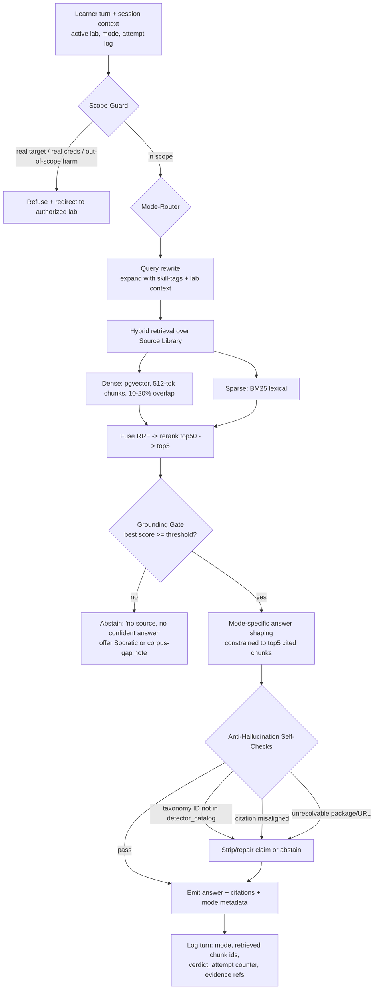
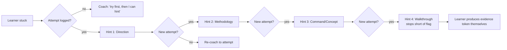
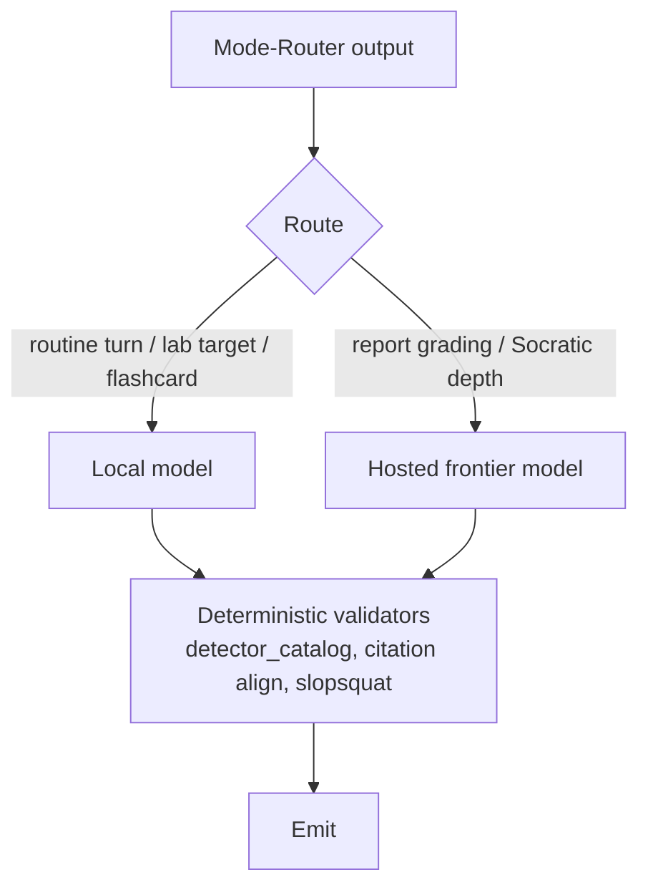

# AI Tutor + Examiner Bot

> Purpose: Specify the retrieval-first conversational engine that teaches, coaches, drills, hints, grades reports, and runs as a terse exam examiner — grounded in the Source Library, bound to the shared taxonomy, and incapable of inventing security facts or coaching attacks on real systems.

The Tutor + Examiner Bot is OSAI Prep Studio's sixth pillar. It is **not** a general chatbot. It is a **retrieval-first, mode-switched, citation-enforced** assistant whose factual surface is the curated Source Library ([09a-source-library.md](09a-source-library.md)) and whose taxonomy is the same `owasp_id` / `atlas_technique` / `detector` / `severity` spine used by the grader, lessons, SRS, and report classifier (see the ARCHITECTURAL INVARIANT in [09b-reuse-map.md](09b-reuse-map.md)). Every factual security claim it makes either maps to a retrieved chunk or it abstains. It never coaches attacks against real, named, or external systems — only the learner's current authorized lab ([11-safety-legal-ethics.md](11-safety-legal-ethics.md)).

The design principle, borrowed straight from OffSec culture: **the bot is a coach in a range, not an answer key.** It pushes the learner toward earning the flag; it never hands it over.

---

## 1. Design goals and non-goals

| Goal | Mechanism |
|---|---|
| Never hallucinate a security fact | Retrieval-first; grounding gate; "no source, no confident answer"; taxonomy-ID validation against `detector_catalog()` |
| Never short-circuit learning | Socratic / Lab-Hint ladder modes; hint tiers gated behind real attempts; final tier stops short of the flag |
| Stay aligned to the exam | Modes mirror exam phases (recon → exploit → post-exploit → report); Exam Simulator persona logs evidence and refuses to teach |
| One taxonomy, five consumers | Skill-tags, gold-set labels, report findings, SRS units, and grader verdicts all read the same Finding fields |
| Authorized-lab-only | Scope-guard refuses real targets, real creds, real-world harm before any retrieval runs |
| Affordable + fast | Model router: local model for routine turns and lab targets, hosted frontier model only for report-grading and Socratic depth |

**Non-goals.** The bot does not browse the live web at answer time (the corpus is the source of truth; freshness is a corpus-ingest concern). It does not store proprietary OffSec course text in the corpus ([11-safety-legal-ethics.md](11-safety-legal-ethics.md)). It does not act as the lab target — that is the harness's job (`../red-team/local_redteam_harness.py`); the bot *coaches* the learner who is attacking the target.

---

## 2. The retrieval-first pipeline

Every learner turn flows through the same backbone. Mode only changes the **answer-shaping** stage and the **constraints**, never whether grounding is enforced.

### 2.1 Stage detail

1. **Scope-Guard (pre-retrieval).** Cheap classifier + rule pass. Refuses before spending retrieval/inference budget. See §6.
2. **Mode-Router.** Resolves the active mode from explicit selection, session state (e.g., learner is mid-lab → Lab-Hint available), or intent classification. Sets the constraint profile (§3).
3. **Query rewrite.** Expands the raw turn with the active lab's skill-tags (the `owasp_id`/`atlas_technique` of the current challenge) and recent conversation, so retrieval hits the right corpus region. Does **not** add facts — only retrieval terms.
4. **Hybrid retrieval.** Dense vectors in **pgvector** (chosen for <5M vectors, co-located with Postgres, transactional consistency with lesson/SRS state — see [07-architecture-and-stack.md](07-architecture-and-stack.md)) over **512-token recursive chunks with 10–20% overlap**; parallel **BM25** lexical search for exact-term recall (technique IDs, CVE-like strings, tool flags). Fuse with reciprocal-rank fusion, rerank **top50 → top5**.
5. **Grounding Gate.** If the best reranked score is below the per-mode threshold, the bot **abstains** rather than answering. This is the load-bearing anti-hallucination control. Abstention text names the gap and offers a Socratic turn instead.
6. **Answer shaping.** Mode-specific. The generation prompt is constrained to the top-5 chunks; the model is instructed that any claim not supported by a chunk must be dropped.
7. **Anti-hallucination self-checks (post-generation).** §5. Taxonomy validation, citation alignment, closed-book ban, slopsquat resolution. Failures trigger repair-or-abstain.
8. **Log.** Every turn records mode, retrieved chunk IDs, any grader verdict, the attempt counter, and evidence references — feeding [05-progress-engine.md](05-progress-engine.md) and the gold-set gate ([04-evaluation-harness.md](04-evaluation-harness.md)).

---

## 3. The seven modes

Each mode is a `(persona, constraints, retrieval-profile, exit-criteria)` tuple over the same pipeline. The grounding gate and self-checks are **always on**; modes differ in what they're allowed to *say* with the grounded material.

| # | Mode | One-line behavior | Hard constraints |
|---|---|---|---|
| 1 | **Tutor** | Cited explanations of concepts, frameworks, techniques | Every material claim carries a citation; abstains if ungrounded; never reveals a lab flag |
| 2 | **Socratic Coach** | Asks questions only — leads the learner to the answer | **Emits no declarative answer**; only questions/prompts; max N questions before suggesting Tutor mode |
| 3 | **Lab-Hint Ladder** | Tiered hints, each gated behind a real attempt | Tier escalation requires a logged attempt; final tier stops short of the flag/evidence token |
| 4 | **Flashcard Drill** | SRS cards generated from skill-tags | Cards map to taxonomy units; grading is exact-match/rubric, not free chat |
| 5 | **Report-Reviewer** | Grades a learner report vs the Finding schema + rubric | Scores against fixed rubric; cites the schema; never rewrites the report *for* the learner |
| 6 | **Exam Simulator** | Terse examiner persona; logs evidence; no teaching | **No explanation, no hints, no encouragement**; records evidence tokens only |
| 7 | **No-Hints** | Plain Q&A with hints disabled | Tutor-style citations allowed; Lab-Hint and walkthroughs hard-disabled |

### 3.1 Tutor (cited explanations)

The default teaching mode. Answers "what is indirect prompt injection?" or "how does ATLAS map LLM01?" with a grounded, cited explanation drawn from the Source Library — `../reference/owasp-llm-top-10.md`, `../reference/mitre-atlas.md`, `../reference/glossary.md`, and the framework spine.

- **Retrieval profile:** broad; top-5 chunks; moderate grounding threshold.
- **Output contract:** prose + a citations block; each paragraph's load-bearing claim references a chunk ID. Confidence labels where exam specifics are asserted (e.g., "exam module mapping is *medium-confidence*, per the gated AI-300 FAQ").
- **Refusal:** if asked for a lab's solution, downgrades to a Lab-Hint offer; it explains the *technique class* but not the *instance answer*.

### 3.2 Socratic Coach (questions only, never the answer)

For learners who are close but stuck, or who learn better by reasoning. The bot **only asks questions**. It retrieves the same grounded material but uses it to *form good questions*, not to state conclusions.

- **Hard constraint:** the response contains no declarative answer to the learner's question. A post-generation check rejects any output that asserts the solution; on failure it regenerates as a question or abstains.
- **Example.** Learner: "Why won't my indirect injection fire?" → Bot: "Which channel is your payload arriving on? The detector for indirect injection only fires on untrusted channels — can you name them from `detectors.py`? Where is *your* payload entering the pipeline?"
- **Model routing:** this mode benefits from frontier-model reasoning depth, so the router escalates (§4).
- **Exit:** after a capped number of Socratic turns without progress, it offers Tutor or Lab-Hint mode rather than dragging.

### 3.3 Lab-Hint Ladder (tiered, attempt-gated, flag-safe)

The core of "coach, not answer key." Four tiers of increasing specificity, **each gated behind a real attempt** logged by the lab harness. You cannot skip to Hint 4.

| Tier | Reveals | Gate to unlock |
|---|---|---|
| **Hint 1 — Direction** | *Which* OWASP/ATLAS category is in play; where to look | First genuine attempt logged for this challenge |
| **Hint 2 — Methodology** | The general approach / attack pattern (no commands) | A second distinct attempt after Hint 1 |
| **Hint 3 — Command / Concept** | A concrete technique, command shape, or payload concept | A third attempt after Hint 2 |
| **Hint 4 — Walkthrough** | A guided walkthrough of the steps | A fourth attempt after Hint 3 |

- **Flag-safe invariant.** **Even Hint 4 stops short of the flag** and short of the evidence token. It walks the learner up to the door; they turn the handle. The two-signal grade still requires (a) the reused detector verdict to fire **and** (b) a physical evidence token — a `/flag` file, a DB-state change, or a callback-server hit ([02-lab-range.md](02-lab-range.md), [04-evaluation-harness.md](04-evaluation-harness.md)). The bot can describe *how* to produce the token but never emits the token's value.
- **Attempt gating.** "Real attempt" = the harness logged a target interaction (a probe sent, a payload submitted), not a chat message asking for help. This prevents farming hints by repeatedly asking.
- **Retrieval source:** the lab answer-key is itself derived from the reused detectors (`../projects/llm-log-triage/src/detectors.py`) and the offline attack library (`../red-team/local_redteam_harness.py`, `../red-team/pyrit/prompt_injection_probe.py`), so hints are grounded in the same logic that grades the lab.
- **No-Hints override.** If the learner enabled No-Hints (§3.7) or is in an exam, the ladder is disabled entirely.

### 3.4 Flashcard Drill (SRS from skill-tags)

Generates spaced-repetition cards from the learner's **skill-tags** — the same `owasp_id`/`atlas_technique`/`detector` units used everywhere. A learner weak on `indirect_prompt_injection (LLM01 / AML.T0051.001)` gets cards on the untrusted-channel rule, the encoded-payload variant, and the detection regex.

- **Card source:** seeded from the gold-set question seeds in `../reference/owasp-llm-top-10.md` and `../reference/mitre-atlas.md`; each card is taxonomy-tagged so mastery rolls up into the progress engine ([05-progress-engine.md](05-progress-engine.md)).
- **Grading:** exact-match for IDs/terms, short-rubric for explanations — not open chat. The grounding gate still applies to any explanatory feedback.
- **Scheduling:** the SRS algorithm and mastery model live in [05-progress-engine.md](05-progress-engine.md); this mode is the card-generation + review surface.

### 3.5 Report-Reviewer (grades vs Finding schema + rubric)

The mode that mirrors the **report-heavy reality of the OSAI exam** — a professional report is a required deliverable, and whether it is weighted *as heavily as* the technical findings is **`pending` (OSAI-CLAIM-011, see [00b-exam-blueprint.md](00b-exam-blueprint.md))**, awaiting the final OSAI Exam Guide. We treat reporting as first-class regardless, because over-investing in it is the safe bet.

- **Rubric basis:** the analyst runbook and case-study exemplars (`../docs/playbook/analyst-runbook.md`, `../docs/llm-log-triage-case-study.pdf`) plus the `Finding` dataclass and its `as_row()` schema (`../projects/llm-log-triage/src/detectors.py`).
- **What it grades:** does each finding carry a valid `owasp_id` + `atlas_technique` (validated against `detector_catalog()`)? Correct severity? Reproduction steps that match a real evidence token? Clear impact + remediation? Professional structure?
- **Hard constraint:** it **grades and critiques**, it does **not write the report for the learner**. It can point to a missing reproduction step; it will not author it.
- **Model routing:** report-grading escalates to the **hosted frontier model** for judgment quality (§4). This is also a gold-set-gated capability ([04-evaluation-harness.md](04-evaluation-harness.md)) — the reviewer's scores are themselves evaluated against labeled exemplars before the mode ships.
- **Cross-link:** the report templates and Canva study-pack export are in [08-reporting-and-canva.md](08-reporting-and-canva.md).

### 3.6 Exam Simulator (terse examiner, logs evidence, no teaching)

The persona for Performance Mode and full mock engagements ([06-exam-simulator.md](06-exam-simulator.md)). It behaves like a **proctor, not a coach.**

- **Persona:** terse, neutral, procedural. Acknowledges submissions; states whether an evidence token was accepted; nothing more.
- **Hard constraints:** **no teaching, no hints, no Socratic questions, no encouragement, no framework explanation.** Lab-Hint ladder is disabled. The grounding gate still runs (so it never asserts a wrong fact), but its answer surface is collapsed to evidence-logging and procedural acknowledgement.
- **What it logs:** evidence tokens (`/flag`, DB-state, callback hits), timestamps, phase (recon/exploit/post-exploit), and report submission — the engagement transcript that the scoring engine and post-exam review consume.
- **Why:** mirrors the **24h proctored hands-on engagement** (`confirmed`) plus a **report window whose length is `pending` (OSAI-CLAIM-010)** — see the claim ledger in [00b-exam-blueprint.md](00b-exam-blueprint.md) ([OSAI Exam FAQ](https://help.offsec.com/hc/en-us/articles/46669767163156-OSAI-Advanced-AI-Red-Teaming-Exam-FAQ)). Note OSAI **uniquely allows AI tools in-exam** ([AI Usage Policy](https://help.offsec.com/hc/en-us/articles/35549468971156-AI-Usage-Policy-in-OffSec-Exams), specific guidelines pending) — so the Exam Simulator has an **AI-assisted variant** (the bot stays available as a generic assistant but in examiner persona) and a **no-AI variant** (bot fully muted except evidence-logging), matching the dual-mode design throughout the suite.

### 3.7 No-Hints

A learner-toggled discipline mode. Plain, Tutor-style cited Q&A is allowed, but **Lab-Hint ladder and walkthroughs are hard-disabled.** For learners who want to self-test without the temptation of escalating hints. Distinct from Exam Simulator: No-Hints still teaches and explains; Exam Simulator does neither.

---

## 4. Model router

The bot is **dual-model** to balance cost, latency, and judgment quality. Routing is per-turn and per-mode, decided after the Mode-Router resolves the mode.

| Workload | Model tier | Why |
|---|---|---|
| Routine Tutor/Flashcard turns, scope-guard, query rewrite, retrieval reranking | **Local model** | High volume, latency-sensitive, judgment is bounded by grounded chunks |
| **Lab targets** (the thing the learner attacks) | **Local model** | Must run offline/air-gapped in the range; "blocks the obvious, leaks on the subtle" template from `../red-team/local_redteam_harness.py` |
| **Report-Reviewer grading** | **Hosted frontier model** | Nuanced rubric judgment; gold-set-gated; correctness matters more than cost |
| **Socratic Coach depth** | **Hosted frontier model** | Generating good questions (not answers) needs strong reasoning |
| Anti-hallucination self-checks (taxonomy/citation/slopsquat) | **Local model + deterministic validators** | Mostly rule-based; LLM only for citation-alignment phrasing |

The router is also the **cost governor**: hosted-model calls are budgeted per learner/session and logged. Architecture and deployment of both tiers live in [07-architecture-and-stack.md](07-architecture-and-stack.md).

---

## 5. Anti-hallucination controls

"No source, no confident answer" is the policy. Five mechanisms enforce it; they run as a gate, not a suggestion.

### 5.1 Answer policy: "no source, no confident answer"

If the grounding gate (§2.1 step 5) does not return a chunk above threshold, the bot **abstains** — it states it has no grounded source, names the apparent corpus gap, and offers a Socratic turn or flags the gap for corpus authors ([12-content-authoring.md](12-content-authoring.md)). It does **not** fall back to parametric knowledge for security facts.

### 5.2 Taxonomy-ID validation against `detector_catalog()`

Any time the bot emits an `owasp_id` (e.g., `LLM01`) or `atlas_technique` (e.g., `AML.T0051.001`), the value is validated against the machine inventory `detector_catalog()` in `../projects/llm-log-triage/src/detectors.py`. An ID that is not in the catalog is either repaired (mapped to the nearest valid pair) or the claim is dropped. This is the **same CI check** that validates every lab/lesson/question tag against the catalog (the ARCHITECTURAL INVARIANT) — the bot is just one more consumer of the single taxonomy spine. It cannot invent a technique ID that the grader doesn't recognize.

### 5.3 Citation-alignment self-check

Post-generation, each material claim is re-matched against its cited chunk (entailment-style check). A claim whose citation does not actually support it is stripped or rewritten to what the chunk supports. This catches the "right-looking citation, wrong content" failure mode.

### 5.4 Closed-book ban on factual security claims

The generation prompt forbids stating security facts from parametric memory. Concretely: framework details, technique mechanics, tool behavior, CVE/version claims, and exam specifics must come from retrieved chunks. General pedagogy and conversational glue may be ungrounded; **factual security assertions may not.** Exam specifics additionally carry a confidence label, since some module-level detail is medium-confidence from gated OffSec FAQs.

### 5.5 Slopsquat package/URL resolution (dogfooding LLM09)

Before the bot recommends installing a package or visiting a URL (e.g., "use `garak`", "install `pyrit`"), it **resolves the name/URL against an allowlist** of known-good references (the [canonical source URLs](09a-source-library.md) and the verified tool list: [PyRIT](https://github.com/microsoft/PyRIT), [garak](https://github.com/NVIDIA/garak), [promptfoo](https://www.promptfoo.dev/docs/red-team/), [Giskard](https://www.giskard.ai/), [RAGAS](https://www.ragas.io/), [DeepEval](https://deepeval.com/), [TruLens](https://www.trulens.org/)). An unresolvable package name or URL is flagged, not emitted. This is the bot **dogfooding the very LLM09 (Misinformation / package hallucination / "slopsquatting")** risk it teaches — if it can't resolve a name to a real source, it won't recommend it.

---

## 6. Authorized-lab-only safety policy

The Scope-Guard runs **first**, before retrieval, and is non-negotiable. Full policy in [11-safety-legal-ethics.md](11-safety-legal-ethics.md); the bot-specific rules:

| Trigger | Action |
|---|---|
| Request targets a **real, named, or external system** (a company, a public URL, a production AI) | **Refuse**; redirect to the current authorized lab |
| Request for **real credentials, real exploits against real infra, or real-world harm** | **Refuse**; explain the authorized-lab-only boundary |
| Request to **exfiltrate to a real callback** outside the lab's sandbox | **Refuse**; only lab-internal callback servers are in scope |
| In-scope lab request | Proceed through the pipeline |

- **Scope binding.** The bot is scoped to the learner's **current lab**. Coaching, hints, and walkthroughs apply to that lab's sandboxed target only. It will not generalize an attack to "and here's how you'd do it against \<real product\>."
- **Refusal tone.** OffSec-aligned: direct, professional, not preachy. "That's out of scope — this range is authorized-lab-only. Let's get the flag in your current lab instead." Then it redirects.
- **Refusal ≠ abstention.** Abstention (§5.1) is "I have no grounded source." Refusal (§6) is "this is out of scope/unsafe." They are logged distinctly so the gold-set gate can verify both behaviors ([04-evaluation-harness.md](04-evaluation-harness.md)).
- **Dual-mode coherence.** The same safety policy holds in both AI-assisted and no-AI exam variants; muting the bot's *teaching* surface in Exam Simulator does not relax its *safety* surface.

---

## 7. Acceptance criteria

The bot ships only when it passes the gold-set gate ([04-evaluation-harness.md](04-evaluation-harness.md)). Mode-level acceptance:

| Capability | Acceptance criterion |
|---|---|
| Grounding gate | On a held-out set of out-of-corpus questions, abstention rate ≥ target; no confident ungrounded security claims |
| Taxonomy validation | 100% of emitted `owasp_id`/`atlas_technique` values validate against `detector_catalog()` |
| Citation alignment | Sampled material claims entail their cited chunk above threshold |
| Socratic Coach | Zero declarative answers in a labeled adversarial set (graders confirm "no answer leaked") |
| Lab-Hint ladder | No tier emits the flag/evidence token; tier escalation requires a logged attempt in every trace |
| Report-Reviewer | Reviewer scores correlate with human-labeled exemplar grades above threshold; never authors report content |
| Exam Simulator | Zero teaching/hint emissions; all evidence tokens logged with phase + timestamp |
| Slopsquat | Zero unresolvable package/URL recommendations in a fuzz set including hallucinated names |
| Scope-Guard | 100% refusal on a labeled real-target/real-cred/real-harm set; redirects to authorized lab |

---

## Cross-references

- [04-evaluation-harness.md](04-evaluation-harness.md) — the gold-set gate that every mode and self-check is measured against before shipping.
- [09a-source-library.md](09a-source-library.md) — the corpus the retrieval pipeline grounds in.
- [09b-reuse-map.md](09b-reuse-map.md) — the shared-taxonomy invariant and the reuse of `detectors.py` / the harness as grader, answer-key, and classifier.
- [11-safety-legal-ethics.md](11-safety-legal-ethics.md) — the authorized-lab-only and no-proprietary-content policy the Scope-Guard enforces.
- [02-lab-range.md](02-lab-range.md) / [06-exam-simulator.md](06-exam-simulator.md) — the labs the Lab-Hint ladder coaches and the engagement the Exam Simulator proctors.
- [05-progress-engine.md](05-progress-engine.md) — SRS scheduling and mastery rollup behind Flashcard Drill.
- [07-architecture-and-stack.md](07-architecture-and-stack.md) — pgvector, BM25, and the local/hosted model deployment.
- [08-reporting-and-canva.md](08-reporting-and-canva.md) — report templates and study-pack export that Report-Reviewer grades against.

### Sources

- OffSec AI-300 course — https://www.offsec.com/courses/ai-300/
- OSAI Advanced AI Red Teaming Exam FAQ — https://help.offsec.com/hc/en-us/articles/46669767163156-OSAI-Advanced-AI-Red-Teaming-Exam-FAQ
- OSAI Exam Guide (treated as **not-yet-final**; `pending` claims await it — do not cite as confirming) — https://help.offsec.com/hc/en-us/articles/46593096734612-OSAI-Exam-Guide
- AI Usage Policy in OffSec Exams — https://help.offsec.com/hc/en-us/articles/35549468971156-AI-Usage-Policy-in-OffSec-Exams
- OWASP Top 10 for LLM Apps — https://genai.owasp.org/llm-top-10/
- OWASP GenAI Red Teaming Guide — https://genai.owasp.org/resource/genai-red-teaming-guide/
- MITRE ATLAS — https://atlas.mitre.org/
- PyRIT — https://github.com/microsoft/PyRIT · garak — https://github.com/NVIDIA/garak

*Confidence note: only the **24h proctored technical window** and the **in-exam AI allowance** are `confirmed`. The **report-window length** (OSAI-CLAIM-010) and **whether the report is weighted as heavily as findings** (OSAI-CLAIM-011) are `pending` per the claim ledger in [00b-exam-blueprint.md](00b-exam-blueprint.md); the OSAI Exam Guide is treated as not-yet-final and must not be cited as confirming. Module-to-mode mappings are `inferred`. 00b is the authoritative source for all labeled exam facts.*
