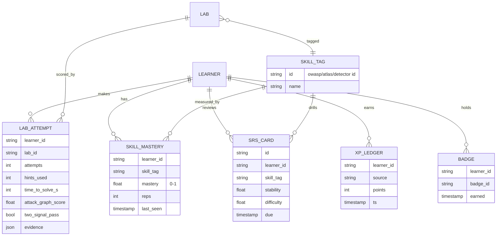
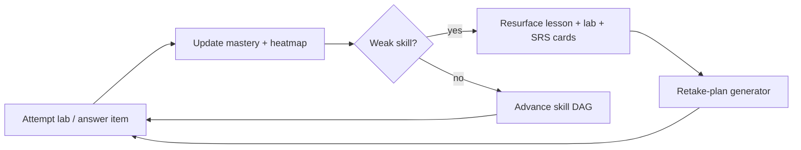

# Progress Engine & Gamification

> Purpose: Specify how the studio proves a learner is getting better — mastery tracking on the shared taxonomy, spaced repetition, a weakness heatmap, and XP/leaderboard features that stay **secondary to real readiness** ([14-readiness-model.md](14-readiness-model.md)).

## 1. Design stance

Gamification serves readiness, never replaces it. XP and a leaderboard mirror AI-300's own course gamification (OSAI-CLAIM-013) but the headline metric a learner sees is the **readiness score** (R0–R5), not XP. Every progress signal is keyed to the **shared taxonomy** so "mastery" means the same thing across lessons, labs, the SRS, and the report grader.

## 2. Data model



`skill_tag.id` is a `detector_catalog()` id — the same value the grader emits, the lesson tags, and the gold-set labels (see [09b-reuse-map.md](09b-reuse-map.md)).

## 3. Mastery & the skill graph

Skills form a DAG with prerequisite edges (e.g., `LLM01:2025` direct → indirect → encoded; recon → exploit). **Mastery** per skill is updated from evidence: lab passes (heavy weight), gold-set items (medium), SRS retention (light). Mastery **propagates**: failing a prerequisite caps the effective mastery of dependents until remediated. This DAG drives the adaptive path and the weakness heatmap.

```
mastery_new = clamp(mastery_old + α·(signal − mastery_old), 0, 1)
  signal = 1.0 lab two-signal pass · 0.7 gold-set correct · 0.4 SRS recall · 0.0 fail
  α = 0.5 (lab) · 0.3 (gold-set) · 0.15 (SRS)
effective_mastery(skill) = min(mastery(skill), min over prereqs p of mastery(p) + 0.1)
```

## 4. Spaced repetition (FSRS)

Flashcards are generated from lesson skill-tags and from *missed* lab/gold-set items. Scheduling uses **FSRS** (stability/difficulty per card; SM-2 acceptable fallback). A failed lab or diagnostic item auto-creates cards and schedules an early review; a recall failure lowers stability and resurfaces the card and its parent lesson. Cards inherit the skill-tag so retention feeds mastery.

## 5. Dashboard analytics

Per learner: completed labs, failed attempts, **time-to-solve**, **hints used**, attack-graph methodology score, report-quality score, and a **weakness heatmap** over OWASP/ATLAS/NIST. The heatmap is the product's most actionable view — it tells the learner exactly which threat classes to drill next and feeds the retake-plan generator ([06-exam-simulator.md](06-exam-simulator.md)).

```
Weakness heatmap (illustrative)
LLM01 ██████████ strong     LLM06 ████░░░░░░ weak
LLM02 ████████░░ ok         LLM07 ███████░░░ ok
LLM05 ██████░░░░ fair       MCP   ███░░░░░░░ weak  <- drill next
```

## 6. XP, badges, streaks, leaderboard

- **XP** awarded per lab × difficulty × (1 − hint penalty) × speed bonus; harder/no-hint/no-AI completions pay more. Logged to `XP_LEDGER`.
- **Badges:** category mastery ("LLM01 Operator"), full-OWASP coverage, first capstone report, no-hint exam pass, detector-builder (Track 6.2).
- **Streaks:** daily review/lab streaks feed SRS adherence.
- **Leaderboard:** cohort-scoped, opt-in, with anti-collusion guards (per-learner flags, [21-world-class-additions.md](21-world-class-additions.md)); a separate "readiness ladder" ranks by readiness score, not XP, to keep incentives honest.

## 7. The adaptive loop



## Cross-references
[01-curriculum.md](01-curriculum.md) (skill-tags) · [06-exam-simulator.md](06-exam-simulator.md) · [08-reporting-and-canva.md](08-reporting-and-canva.md) (report-quality signal) · [14-readiness-model.md](14-readiness-model.md)
