# Exam Simulator — timed performance mode

> Purpose: Specify the timed, multi-target engagement that rehearses the real OSAI exam shape — recon → exploit → post-exploit → evidence → report — and scores it on a transparent rubric. Mirrors the engagement model in [00b-exam-blueprint.md](00b-exam-blueprint.md); report-window length stays configurable (`pending`, OSAI-CLAIM-010).

## 1. What it simulates

A composed subset of the lab range assembled into one **MegacorpAI** enterprise: chat apps, a RAG pipeline, agent/MCP tools, and a cloud/model-server surface — deployed without red-team hardening. The learner must enumerate it, exploit it, prove impact, and submit a professional report, against a clock.

## 2. The graduated ladder

| Mode | Technical window | Targets | When |
|---|---|---|---|
| `MINI` | 4h | 2 targets, 1 domain | After a track |
| `HALF` | 12h | 3–4 targets, 2–3 domains | After Tracks 3–4 |
| `FULL` | 24h (+ report window) | full enterprise, all domains | Exam dress rehearsal |

Each runs in a **no-AI** and an **AI-assisted** variant (per the AI-allowed rule, [18-ai-use-policy-for-exam-mode.md](18-ai-use-policy-for-exam-mode.md)) so the learner practices both the resilient-operator path and the realistic copilot path.

## 3. Engagement flow

```mermaid
flowchart LR
    S[Scenario assembly<br/>seeded per learner] --> T[Timer + proctor-lite starts]
    T --> R[Recon: enumerate AI surfaces]
    R --> X[Exploit in impact order<br/>two-signal evidence per win]
    X --> P[Post-exploit: prove impact]
    P --> EB[Evidence bundle auto-collected]
    EB --> RW[Report window: write the report]
    RW --> SC[Rubric scoring]
    SC --> MP[Missed-path review]
    MP --> RP[Retake-plan generator -> 05]
```

- **Scenario assembly** randomizes target composition and **per-learner flags** (`HMAC(seed, learner_id, lab_id)`) so runs can't be shared ([21-world-class-additions.md](21-world-class-additions.md)).
- **Proctor-lite:** the environment logs activity for honest self-review (no real human proctor; this is practice). `No-Hints` mode silences the tutor except the scope-guard.
- **Evidence bundle:** transcripts, flags, callback hits, DB diffs, and screenshots are collected automatically into a gradable artifact set.

## 4. Scoring (transparent, unlike the real exam)

| Component | Weight | Source |
|---|---:|---|
| Findings (two-signal confirmed) | 45% | grader / ChallengeValidator |
| Methodology (attack-path graphs) | 15% | [16-attack-path-graphs.md](16-attack-path-graphs.md) |
| Report quality | 40% | Report-Reviewer + [19-business-impact-rubric.md](19-business-impact-rubric.md) |

We deliberately weight the report at 40% because OffSec requires it and its exact official weight is `pending` — over-training it is the safe bet. The **pass line is shown** (e.g., ≥ 75% with no failed finding-vs-report mismatch), unlike the real exam, so the learner gets a clear, calibratable signal.

## 5. Missed-path review & retake plan

After scoring, the simulator reveals: which intended targets/paths were missed, the hidden attack-path graph nodes not reached, and where evidence or report quality fell short. The **retake-plan generator** converts gaps into a concrete plan — specific lessons, labs, and SRS cards — and writes them into the progress engine ([05-progress-engine.md](05-progress-engine.md)) so the next attempt is targeted, not a blind repeat.

## 6. Readiness gating

`FULL` exam mode maps to readiness gate **R4**; a clean report-and-findings run plus business-impact translation reaches **R5** ([14-readiness-model.md](14-readiness-model.md)). The studio recommends a learner attempt `FULL` only when their readiness score crosses the exam-ready threshold.

## Cross-references
[00b-exam-blueprint.md](00b-exam-blueprint.md) · [02-lab-range.md](02-lab-range.md) · [05-progress-engine.md](05-progress-engine.md) · [08-reporting-and-canva.md](08-reporting-and-canva.md) · [16-attack-path-graphs.md](16-attack-path-graphs.md) · [18-ai-use-policy-for-exam-mode.md](18-ai-use-policy-for-exam-mode.md)
