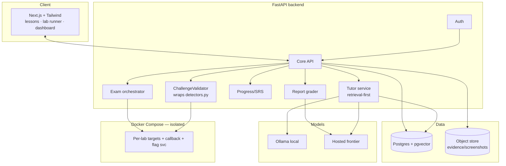
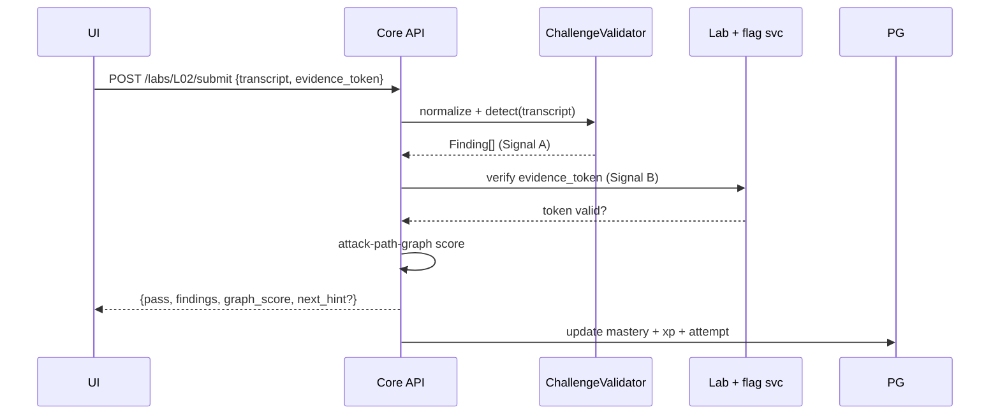

# System Architecture & Tech Stack

> Purpose: Specify the platform architecture, the stack, the data model, and the API surface. The platform's own *threat model* (isolation, egress, abuse) is in [13-platform-threat-model.md](13-platform-threat-model.md). Design-only — no app code ships this phase.

## 1. Stack

| Layer | Choice | Notes |
|---|---|---|
| Frontend | **Next.js + Tailwind** | MDX-rendered lessons, lab runner, dashboard |
| Backend | **FastAPI** (Python) | Aligns with the reused Python detection engine |
| DB | **Postgres + pgvector** | App data + RAG vectors co-located (<5M vectors); **Qdrant** option at scale |
| Auth | Clerk / Auth0 / Supabase Auth | Per-learner + cohort/instructor roles |
| LLM router | local **Ollama** + hosted frontier | Local for routine turns & lab targets; hosted (Claude default) for report-grading/Socratic depth |
| Content | **MDX** | Lessons with skill-tag frontmatter ([12-content-authoring.md](12-content-authoring.md)) |
| Labs | **Docker Compose** | Per-lab ephemeral images ([02-lab-range.md](02-lab-range.md), [13-platform-threat-model.md](13-platform-threat-model.md)) |
| Grader | **ChallengeValidator** service | Wraps `../projects/llm-log-triage/src/detectors.py` |
| Eval | **promptfoo + pytest** | Gold-set gate ([04-evaluation-harness.md](04-evaluation-harness.md)) |
| Study packs | Canva Connect/Apps SDK + **Marp/Mermaid** fallback | [08-reporting-and-canva.md](08-reporting-and-canva.md) |

## 2. System diagram

## 3. "Submit attack → grade" request flow

## 4. Data model

Seeds from `../projects/llm-log-triage/sql/schema.sql` (the `events` / `detections` tables + `v_triage` view), extended with platform tables:

- `learner`, `cohort`, `enrollment`, `role`
- `lesson`, `lab`, `lab_manifest`, `question` (content; schema in [12-content-authoring.md](12-content-authoring.md))
- `lab_attempt`, `finding` (reuses `Finding.as_row()` columns), `evidence`
- `skill_mastery`, `srs_card`, `xp_ledger`, `badge` ([05-progress-engine.md](05-progress-engine.md))
- `goldset_item`, `eval_run` ([04-evaluation-harness.md](04-evaluation-harness.md))
- `source_chunk` (pgvector; metadata per [09a-source-library.md](09a-source-library.md))
- `ai_use_event` ([18-ai-use-policy-for-exam-mode.md](18-ai-use-policy-for-exam-mode.md))

The `finding` table's `owasp_id/atlas_technique/detector/severity` columns are the canonical taxonomy join key across the whole schema (the invariant, [09b-reuse-map.md](09b-reuse-map.md)).

## 5. API surface (representative)

| Method | Path | Purpose |
|---|---|---|
| POST | `/auth/*` | login/session |
| GET | `/curriculum`, `/lessons/{id}` | content |
| POST | `/labs/{id}/start`, `/labs/{id}/submit`, `/labs/{id}/reset` | lab lifecycle + two-signal grading |
| POST | `/tutor/ask` | retrieval-first answer (mode, lab context) |
| POST | `/exam/start`, `/exam/{id}/submit-report` | timed engagement |
| POST | `/reports/{id}/grade` | Report-Reviewer |
| GET | `/progress`, `/progress/heatmap` | mastery + weakness heatmap |
| GET | `/readiness` | R0–R5 score ([14-readiness-model.md](14-readiness-model.md)) |
| POST | `/study-pack/export` | Canva/Marp export ([08-reporting-and-canva.md](08-reporting-and-canva.md)) |

## 6. Deployment

- **Frontend:** Vercel. **Backend:** Railway/Fly.io/Render, or a single-VPS Docker deployment for self-hosting.
- **Labs:** isolated Docker network per learner/lab; egress deny-all except the callback container ([13-platform-threat-model.md](13-platform-threat-model.md)).
- **Cost control:** local-first model routing; retrieval caching; per-learner rate/spend caps — the platform **dogfoods its own LLM10 consumption-anomaly detector** (`../projects/llm-log-triage/sql/analysis/06_consumption_anomaly.sql`) to catch its own denial-of-wallet.

## Cross-references
[02-lab-range.md](02-lab-range.md) · [03-tutor-examiner-bot.md](03-tutor-examiner-bot.md) · [04-evaluation-harness.md](04-evaluation-harness.md) · [13-platform-threat-model.md](13-platform-threat-model.md)

## Sources
- pgvector vs Qdrant: <https://github.com/pgvector/pgvector>, <https://qdrant.tech/> · Ollama: <https://ollama.com/>
