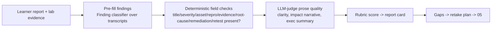
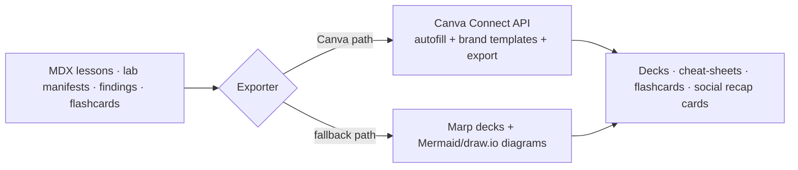

# Reporting Engine & Study-Pack Generation

> Purpose: Specify the studio's biggest differentiator — a first-class report template + auto-grading Report-Reviewer (OffSec requires a professional report) — plus the study-pack/diagram generation pipeline. Report scoring detail lives in [19-business-impact-rubric.md](19-business-impact-rubric.md).

## 1. Why reporting is a headline feature

OffSec's exam requires a professional report documenting findings, impact, and remediation. Whether it is weighted *equally* with technical findings is `pending` (OSAI-CLAIM-011), but most prep tools ignore reporting entirely — so we over-invest. The reused detection engine makes this uniquely cheap: the same `Finding` classifier that grades exploits also **pre-fills report findings**.

## 2. Report templates

### 2.1 Finding template

> The **canonical** finding schema (full business-impact dimensions, severity model) is [19-business-impact-rubric.md](19-business-impact-rubric.md) §2; the abbreviated view below is the report-author's quick reference and must not diverge from it.

```yaml
finding:
  title: "Indirect Prompt Injection Leaks Confidential HR Policy via RAG Assistant"
  severity: "High"            # Critical|High|Medium|Low|Informational ([19])
  confidence: "High"
  affected_assets: ["MegacorpAI HR Assistant", "vector index: hr_docs"]
  owasp: "LLM01:2025"
  atlas: "AML.T0051.001"
  nist_ai_rmf: ["MAP", "MEASURE", "MANAGE"]
  business_impact: {confidentiality: High, integrity: Medium, availability: Low, financial: Medium, regulatory: Medium}
  evidence: ["transcript_id", "flag_id", "callback_log", "screenshot"]
  reproduction: ["step 1 ...", "step 2 ..."]
  root_cause: ["retrieved content treated as instructions, not untrusted data"]
  remediation:
    immediate: ["isolate retrieved content from instructions", "source allowlist + doc ACLs", "output DLP"]
    strategic: ["RAG threat model", "adversarial retrieval evals in CI"]
  retest: ["re-run L02 attack-graph N1-N7", "confirm no planted-secret disclosure"]
```

### 2.2 Report structure
Executive summary (business language) · engagement scope & rules of engagement · methodology (recon→exploit→post-exploit) · findings (the template above, severity-ordered) · remediation roadmap · retest notes · technical appendix (raw evidence). Seeded from `../docs/playbook/analyst-runbook.md` and the `../docs/llm-log-triage-case-study.pdf` exemplar.

## 3. The Report-Reviewer (auto-grader)



- **Pre-fill:** the `Finding` finding-classifier (`../projects/llm-log-triage/src/detectors.py`) reads the learner's attack transcript and proposes the OWASP/ATLAS/severity classification, so grading checks whether the learner's *written* finding matches the *evidence*.
- **Two-tier grading:** deterministic checks for required fields (cheap, reliable) + an LLM-judge for prose/impact quality (gated by the gold-set's `report_quality` bank, [04-evaluation-harness.md](04-evaluation-harness.md)).
- **Rubric:** correct classification 15% · evidence quality 20% · reproduction clarity 15% · business impact 15% · root cause 10% · remediation 15% · retest 10% (see [19-business-impact-rubric.md](19-business-impact-rubric.md)).

## 4. Study-pack generation pipeline

Auto-generate polished study materials from the same MDX/lab/finding content.



- **Canva path:** Canva **Connect API** (autofill brand templates, asset upload, design export) and the **Apps SDK Design Editing API** via OAuth 2.0 + PKCE — for polished decks, worksheets, flashcards, and cheat sheets.
- **Fallback path (MVP-safe):** **Marp** generates decks and **Mermaid / draw.io** generate diagrams from the *same* MDX, so the MVP never blocks on Canva OAuth. Canva is a Phase-4 enhancement, not a dependency.

## 5. Visual AI-architecture / attack-path diagram builder

Generate Mermaid diagrams for RAG apps, agent/MCP workflows, trust boundaries, and **attack paths** (rendered from the attack-path graphs, [16-attack-path-graphs.md](16-attack-path-graphs.md)) — for both lessons and the learner's report appendix.

## Cross-references
[05-progress-engine.md](05-progress-engine.md) · [06-exam-simulator.md](06-exam-simulator.md) · [09a-source-library.md](09a-source-library.md) · [12-content-authoring.md](12-content-authoring.md) · [16-attack-path-graphs.md](16-attack-path-graphs.md) · [19-business-impact-rubric.md](19-business-impact-rubric.md)

## Sources
- Canva Connect APIs: <https://www.canva.dev/docs/connect/> · Canva Apps Design Editing: <https://www.canva.dev/docs/apps/design-editing/> · Marp: <https://marp.app/> · Mermaid: <https://mermaid.js.org/>
