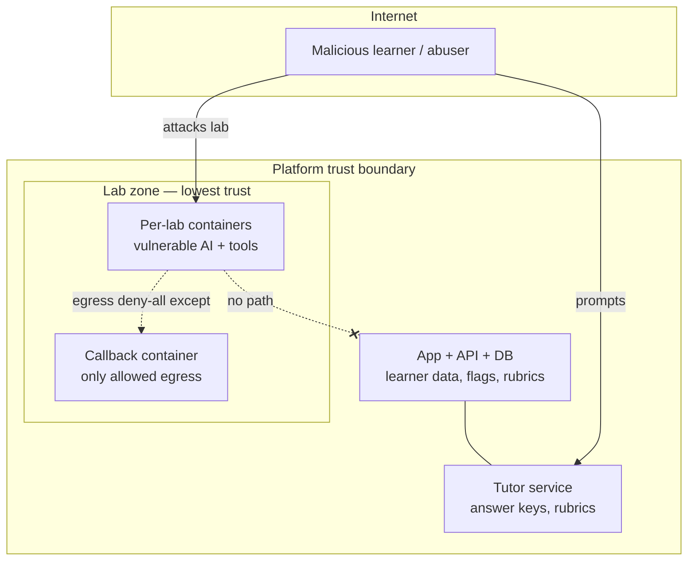

# Platform Threat Model

> Purpose: The studio *hosts deliberately-vulnerable AI and runs untrusted learner attack input.* This doc models threats to the **platform itself** (distinct from the content/conduct policy in [11-safety-legal-ethics.md](11-safety-legal-ethics.md)) and the controls that contain them.

## 1. Assets & trust boundaries



**Assets:** learner PII/progress; **flags & answer keys**; grading rubrics (instructor-only); platform secrets/credentials; the model router budget; the lab images and host.

## 2. Threats & mitigations (STRIDE-flavored)

| # | Threat | STRIDE | Mitigation |
|---|---|---|---|
| T1 | **Lab-container escape** to host/control plane | Elevation | ephemeral per-lab containers; `--no-new-privileges`; read-only rootfs; drop caps; seccomp/AppArmor profiles; CPU/mem/pids limits; no host mounts |
| T2 | **Learner-vs-learner** access (steal flags/data) | Info disclosure / Tampering | per-learner network namespaces + separate Docker networks; no shared volumes; per-learner flag derivation `HMAC(seed, learner_id, lab_id)`; server-side flag verify |
| T3 | **Egress abuse** — use a lab to attack the internet | Tampering / Elevation | **egress deny-all**; allowlist only the callback container; DNS pinned; outbound rate-limited. This is also the §11 authorized-lab-only control, enforced in infra |
| T4 | **Tutor weaponization / jailbreak** into a real attack tool or answer-key leak | Info disclosure / Repudiation | scope-guard pre-retrieval; lab-scoped context; refusal policy; `tutor_self_redteam` gold-set at 100% ([04-evaluation-harness.md](04-evaluation-harness.md)); answer keys/rubrics never in the learner-mode corpus |
| T5 | **Flag / grader forgery or replay** | Spoofing / Tampering | signed, per-learner, time-boxed flags; server-side two-signal verification; anti-replay nonce; grader runs server-side, never trusts client claims |
| T6 | **Secrets exposure** — planted secrets mistaken for real, or real platform secrets leaking | Info disclosure | all lab secrets are fake/non-production and clearly namespaced (`OSAI{...}`); real platform secrets in a vault, never in lab containers; rotate; scan with the reused secret detectors |
| T7 | **Denial-of-wallet** on the LLM router | DoS | per-learner rate/token/spend caps; **dogfood the LLM10 consumption-anomaly detector** (`../projects/llm-log-triage/sql/analysis/06_consumption_anomaly.sql`); local-first routing; queue + backpressure |
| T8 | **Platform supply chain** — poisoned model/dependency in our own stack | Tampering | pin model digests; prefer `safetensors` over `pickle`; SBOM + `pip-audit` in CI; allowlist model sources (the L17 lesson, applied to ourselves) |
| T9 | **Content/claim drift** weaponized (stale exam rule taught as fact) | Repudiation / Integrity | claim + framework ledgers + CI ([00b-exam-blueprint.md](00b-exam-blueprint.md), [15-framework-version-ledger.md](15-framework-version-ledger.md)) |
| T10 | **Abuse / AUP violation** (pointing tooling at real systems) | Elevation | egress controls (T3) make it infeasible from the range; AUP + monitoring; disable on violation ([11-safety-legal-ethics.md](11-safety-legal-ethics.md)) |

## 3. Lab isolation baseline (every lab container)

```yaml
container_security:
  read_only_root_fs: true
  no_new_privileges: true
  cap_drop: ["ALL"]
  seccomp: "runtime/default (or stricter)"
  network: "per-learner isolated; egress deny-all except callback"
  resources: { cpus: "1.0", memory: "1g", pids: 256 }
  volumes: "none shared; ephemeral"
  lifetime: "ephemeral; deterministic reset; auto-destroy on session end"
```

## 4. Incident response (platform)

Severity tiers mirror the instructor runbook ([20-instructor-ops-runbook.md](20-instructor-ops-runbook.md)): **S1** lab cannot start/reset or unsafe egress → disable lab immediately; **S2** grader false pass/fail → disable scoring, manual review; **S3** hint/UI/template issue → patch next cycle. The platform's own detection reuses the studio's blue-team tooling — it triages its *own* logs with `../projects/llm-log-triage/`.

## Cross-references
[02-lab-range.md](02-lab-range.md) · [03-tutor-examiner-bot.md](03-tutor-examiner-bot.md) · [07-architecture-and-stack.md](07-architecture-and-stack.md) · [11-safety-legal-ethics.md](11-safety-legal-ethics.md) · [20-instructor-ops-runbook.md](20-instructor-ops-runbook.md)
